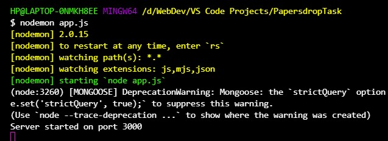
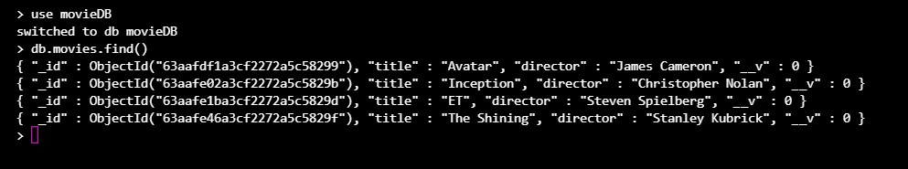
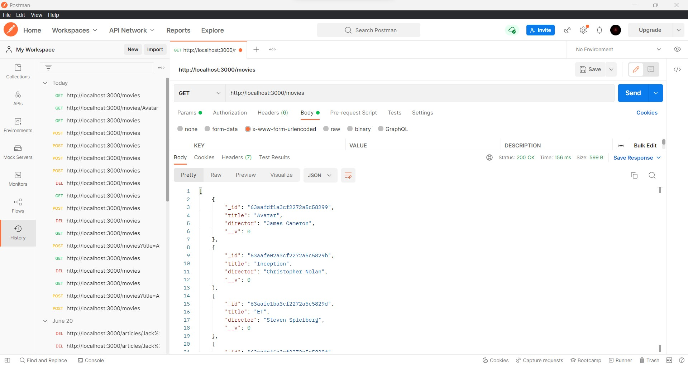
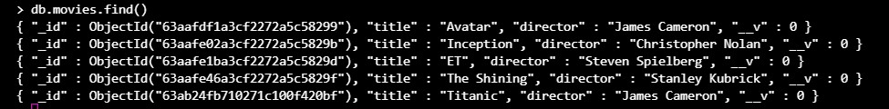
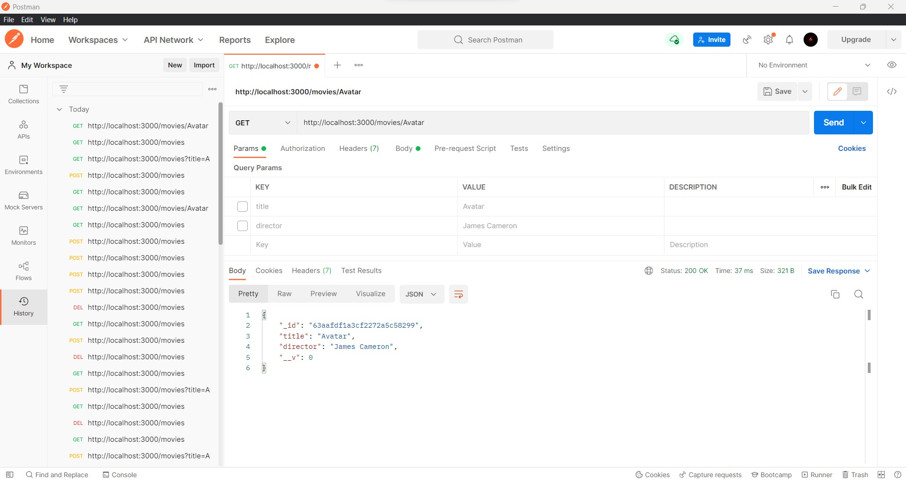
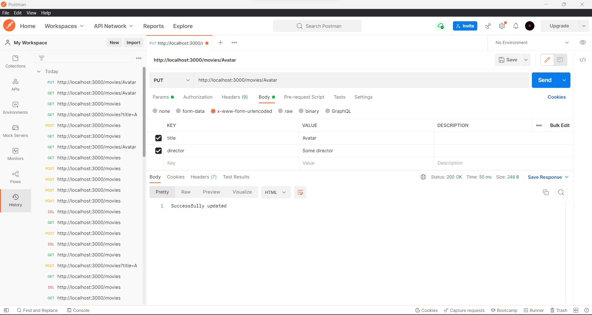
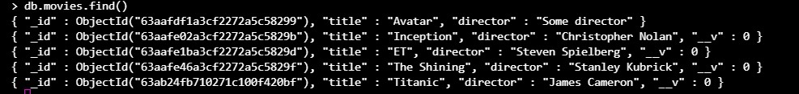
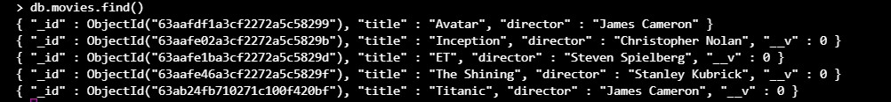
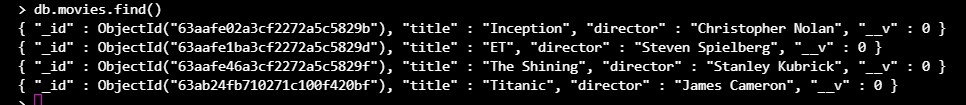
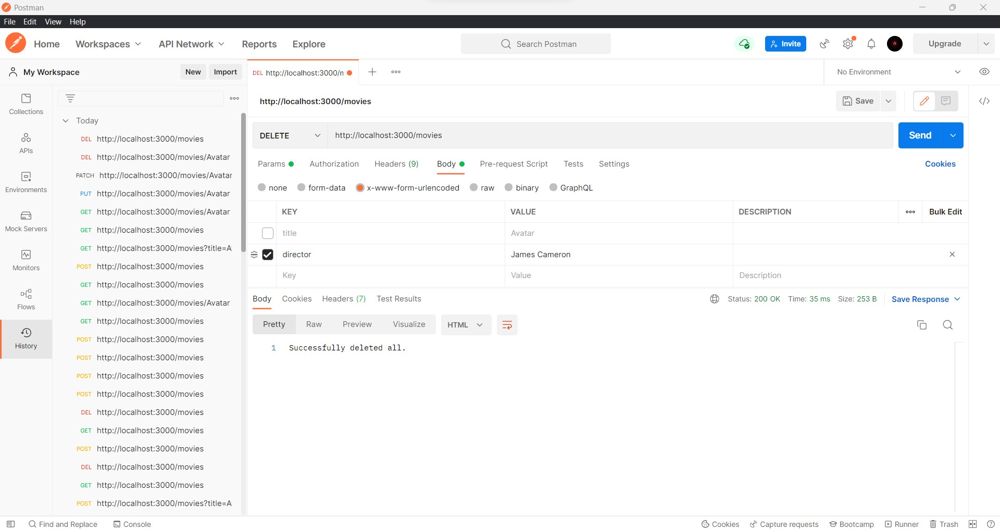

# MovieAPI
A simple RESTful API created using NodeJS. The basic CRUD operations have been implemented on a movie database using the GET, PUT, POST, PATCH and DELETE requests.

## Steps to run:
1) cd over to the directory of the project and run the following commands:   
 

   
   
Note: These commands must be run simultaneously in 3 tabs of the command prompt.   

2) The inital entries in the database are as follows:   
   

## RESTful API demonstration:

1) GET request to retrieve all the entries in the database:
   

2) POST request using Body values to make a new entry in the database:   
   
   

3) GET request to retrieve a particular entry from the database:   
   

4) PUT request to update an entry in the database:   
   
   

5) PATCH request to update an entry in the database:   
   
   

6) DELETE request to delete a single entry in the database:
   
   

7) DELETE request to empty the entire database:   
   
   

NOTE: The changes have been displayed using the Postman tool. The requests are sent on the local host address using a mixture of URL parameters and also body parameters. All the necessary instructions to send the requests have been displayed in the screenshots attached.
